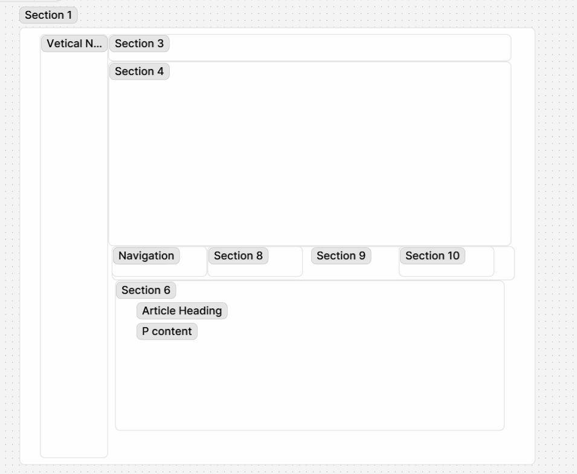

# Module 1 Week 1 In class Codealongs/ Demos

## HTML Day 1

[Week 1 Website](https://codecrew-codeschool.github.io/Week1_HTML_lessons_202508/)

We created the index.html file, defined the html boilerplate, and used basic html elements to strucutre a simple web page. 

The elements we defined were:
- head
- body
- meta
- title
- p
- h1, h2, h3, h4, h5, h6
- ordered lists
- unordered lists
- a
- img

## HTML DAY 2 

Our html page evolved to add tables to it used table elements and discussed nesting html elements on pages:
- th
- tr
- td

We also discussed wireframes, and created a second page in which we chose a website, created a wireframe of its content, and updated the site with a second page that mocks up the wireframe in html.

### In class exercise

Recreated the NOVAA climate page in HTML with some inline CSS

Wireframe

[NOAA Climate Page](https://www.noaa.gov/climate)

[In class Demo](https://codecrew-codeschool.github.io/Week1_HTML_lessons_202508/weather.html)
Full Walkthrough can be viewed in the 202508 Week1 Day 1-3 lecture recordings

## HTML Day 3

[Day 3 content Page](https://codecrew-codeschool.github.io/Week1_HTML_lessons_202508/iframe_demo.html)

We explored more advanced html elements such as:

- iframes
- video
- audio

We also discussed linking between pages in a website. As well as embedding content from other webpages in our websites.
The site deployed from this reponow has a page for each day of class.

Resources (files and images for the site) have been moved into the files directory, and links have been updated
